# **Tutorial: Building a Domo Dashboard PDF Converter**

In this tutorial, you'll learn how to create an app that converts Domo dashboards into downloadable PDFs using Domo's Code Engine and Pro-Code Editor. This app allows users to specify a Domo Page ID, apply filters, and generate a consolidated PDF containing the dashboard tables and charts. This guide assumes familiarity with JavaScript, Pro-Code Editor, and Code Engine Functions.

### **Prerequisites**

- Access to Domo's Pro-Code Editor.
  - To get access to the beta, please reach out to your CSM.
- Basic understanding of JavaScript and the [HTML2PDF.js](https://ekoopmans.github.io/html2pdf.js/) library.
- Code engine enabled in your Domo instance.

---

### **Step 1: Set Up Your Pro-Code Environment**

1.  **Create a New Project in Pro-Code Editor**:

Ensure that Pro-Code Editor is enabled in your Domo instance.
Navigate to your Asset Library.

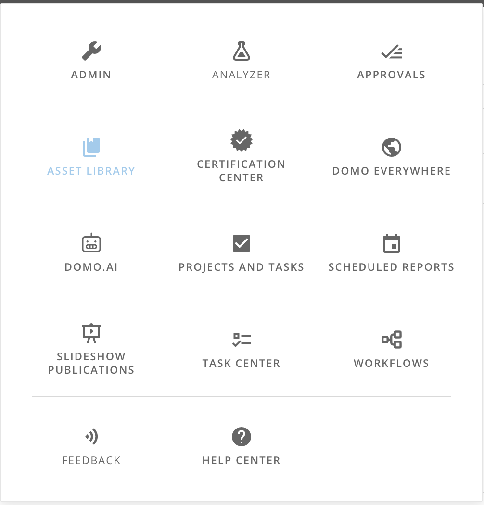

Click on 'Pro-Code Editor' in the top right corner of your screen to open the editor in your browser.

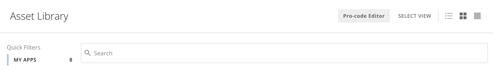

You can now edit the files in your project.
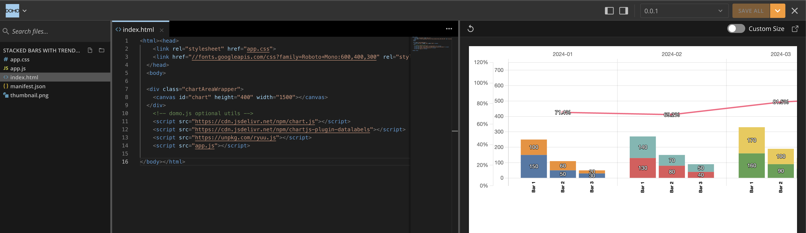

---

### **Step 2: Define the Manifest File (`manifest.json`)**

The `manifest.json` file defines your app's metadata and data mappings in Domo. Update it according to your dataset's structure.

```json
{
  "id": "Pro code Editor id here", // Unique ID created by pro-code editor
  "name": "print-button",
  "description": "",
  "version": "1.0",
  "databasesMapping": [],
  "workflowsMapping": [],
  "size": {
    "width": 6,
    "height": 3
  },
  "fullpage": true,
  "mapping": [
    {
      "dataSetId": "Database ID here", // Example dataset ID
      "fields": [],
      "alias": "Dataset Alias Here", // Used for the wiring of the app
      "dql": null
    }
  ],
  "packagesMapping": [
    // Code engine functions used in the app
    {
      "name": "printingTest",
      "alias": "printFunctions",
      "packageId": "Code engine id here",
      "parameters": [
        // Inputs and outputs of the code engine
        {
          "name": "pageID",
          "displayName": "pageID",
          "type": "text",
          "value": null,
          "nullable": false,
          "isList": false,
          "children": [],
          "entitySubType": null,
          "alias": "pageID"
        }
      ],
      "output": {
        "name": "dashboardResult",
        "displayName": "dashboardResult",
        "type": "object",
        "value": null,
        "nullable": true,
        "isList": false,
        "children": [],
        "entitySubType": null,
        "alias": "pdfResult"
      },
      "version": "1.0.26", // Version of the code engine function used
      "functionName": "page2PDF"
    }
  ]
}
```

We are not using any datasets in the app, but we do need to wire it to be able to access the page filters in a domo dashboard. Code engine functions are used to call the api to generate the encoded pdf that we will decode and build the pdf in the app. Make sure to use the version of your code engine that is functional.

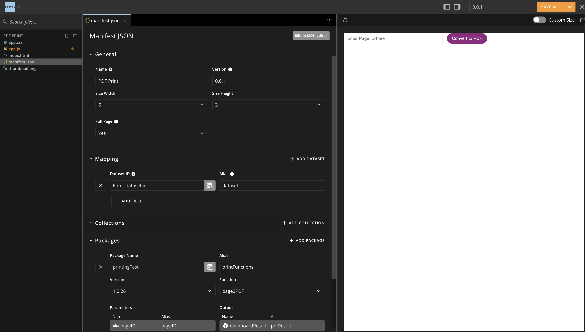

---

### **Step 3: Handling PDF Generation within Code Engine**

#### 3.1\. Setup Code Engine

- Navigate to WorkFlows in your environment and, on the left side, click on the Code Engine icon.

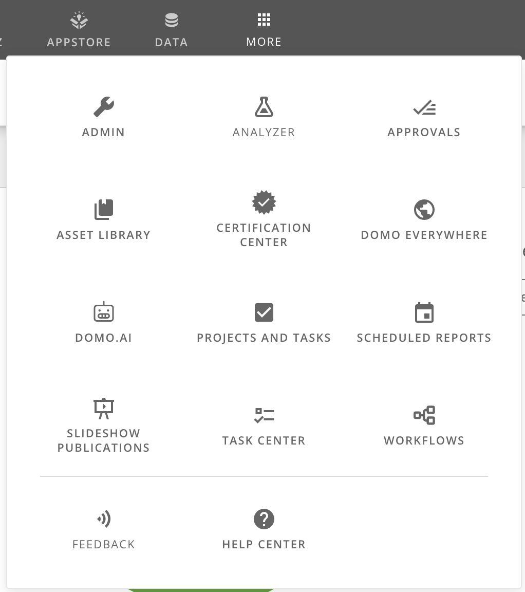
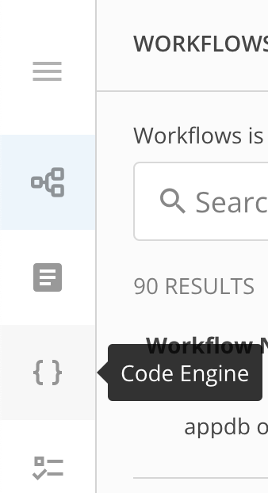

- Create a new Code Engine package, use Javascript as the language.

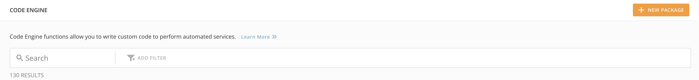
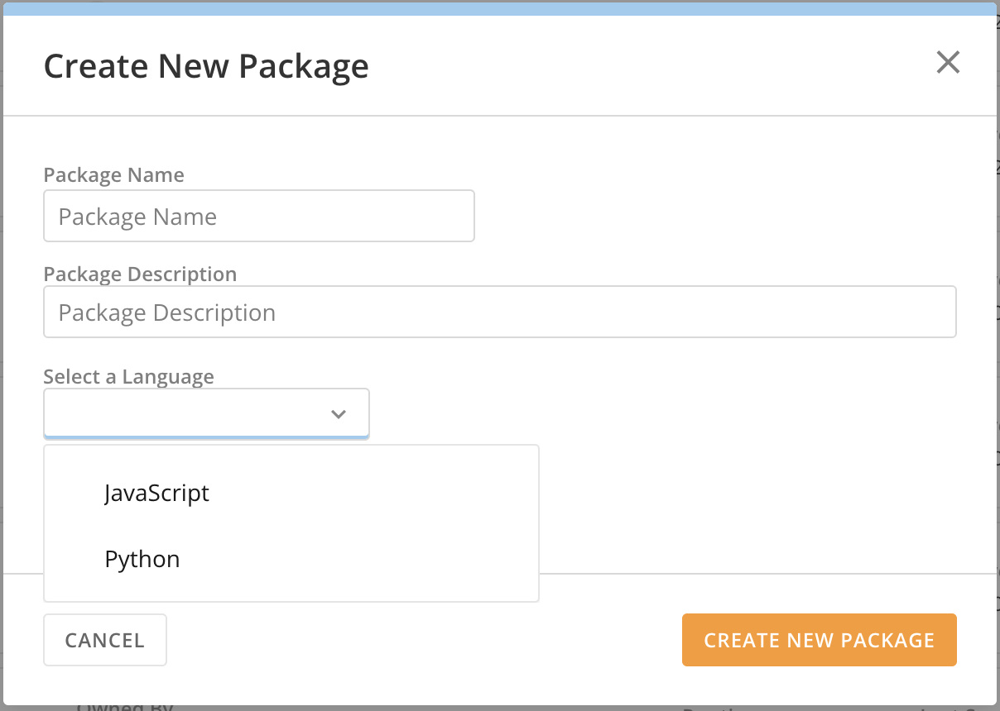

- Everytime you want to use the function, you have to save it and deploy it. Click on the arrow next to the save button on the upper right corner, and click on Deploy.

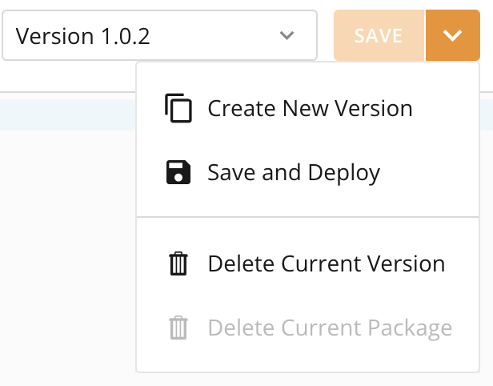

#### 3.2\. Setup Code Engine Helpers

- **Import Code Engine**:
  - Start by importing the `codeengine` module, which will handle all the API requests within your Code Engine function.
  - Define a `Helpers` class that includes a method for making HTTP requests (`handleRequest`). This method will streamline how API calls are made and manage any errors that might occur during the process.

```javascript
const codeengine = require('codeengine');

class Helpers {
  /**
   * Helper function to handle API requests and errors
   *
   * @param {string} method - The HTTP method
   * @param {string} url - The endpoint URL
   * @param {Object} [body=null] - The request body
   * @returns {Object} The response data
   * @throws {Error} If the request fails
   */
  static async handleRequest(method, url, body = null) {
    try {
      return await codeengine.sendRequest(method, url, body);
    } catch (error) {
      console.error(`Error with ${method} request to ${url}:`, error);
      throw error;
    }
  }
}
```

#### 3.3\. Retrieve Cards from a Page

- **Function: `getCardsOnPage`** :
  - This function retrieves all the cards on a given page by calling the `/api/content/v1/pages/{pageID}/cards` endpoint.
  - It utilizes the `Helpers.handleRequest` method to make the API call and returns the list of cards.

```javascript
async function getCardsOnPage(pageID) {
  try {
    var url = `/api/content/v1/pages/${pageID}/cards?parts=metadata,metadataOverrides`;
    return await Helpers.handleRequest('get', url);
  } catch (error) {
    throw new Error('getCardsOnPage: ', error);
  }
}
```

- Set up the inputs and outputs of the function.

### **Input Parameters**

- `pageID`: string

### **OUTPUT Parameters**

- `result`: array

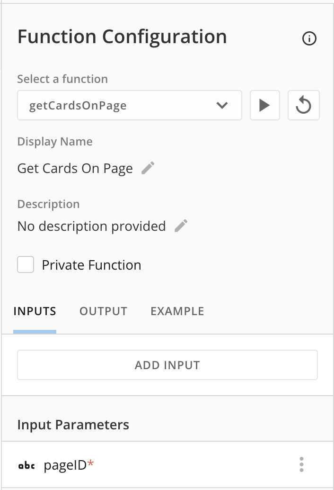

#### 3.4\. Generate PDF for Each Card

- **Function: `getPDF`** :
  - This function is responsible for generating a PDF for a specific card using the card's ID.
  - It makes a `PUT` request to the `/api/content/v1/cards/kpi/{cardID}/render` endpoint, passing any necessary parameters, such as filters, to customize the PDF output.

```javascript
async function getPDF(cardID, params) {
  try {
    const body = params;
    return await Helpers.handleRequest(
      'put',
      '/api/content/v1/cards/kpi/' + cardID + '/render?parts=title,imagePDF,',
      body,
    );
  } catch (error) {
    throw new Error('getPDF: ', error);
  }
}
```

### **Input Parameters**

- `cardID`: string
- `params`: object

### **OUTPUT Parameters**

- `result`: array

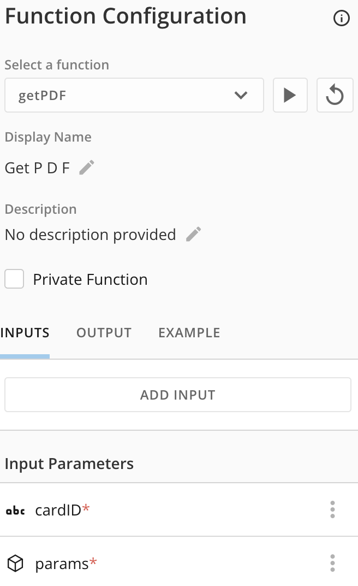

#### 3.5\. Convert Page to PDF

- **Function: `page2PDF`** :
  - This is the core function that brings everything together. It:
    1.  Calls `getCardsOnPage` to retrieve all the cards on the page.
    2.  Iterates through each card and calls `getPDF` to generate a PDF for each one.
    3.  Handles different chart types, setting custom dimensions for the generated PDFs.
    4.  Collects all the generated PDFs into a `pdfResult` array.
    5.  Returns the final dashboard result, which includes the `pdfResult` and any relevant metadata.

```javascript
async function page2PDF(pageID, filters) {
  try {
    const cardArray = await getCardsOnPage(pageID);
    const pdfResult = [];
    const dashboardResult = {};

    for (var i = 0; i < cardArray.length; i++) {
      var md = cardArray[i].metadata;
      var type = cardArray[i].type;

      if (i == 0 && md.textHtml) {
        dashboardResult.metadata = {
          titleHtml: md.textHtml,
        };
      }

      var params = {
        queryOverrides: { filters },
        treatLongsAsStrings: true,
        cardLoadContext: {},
      };

      const regex = /badge_.*_selector/;
      if (
        type === 'domoapp' ||
        type === 'Text' ||
        md.chartType == 'badge_textbox' ||
        regex.test(md.chartType)
      )
        continue;

      if (md.chartType == 'badge_basic_table') {
        params = {
          ...params,
          width: 1800,
          height: 2000,
          scale: 1,
          numTablePages: 2,
        };
      } else if (
        md.chartType == 'badge_singlevalue' ||
        md.chartType == 'badge_donut' ||
        md.chartType == 'badge_filledgauge'
      ) {
        params = {
          ...params,
          width: 300,
          height: 300,
          scale: 1,
        };
      } else {
        params = {
          ...params,
          width: 800,
          height: 500,
        };
      }

      const pdf = await getPDF(cardArray[i].id, params);
      if (pdf.image && pdf.image.pages) {
        result = {
          title: pdf.title,
          image: pdf.image.pages,
        };
      } else {
        result = {
          title: pdf.title,
          image: [pdf.image.data],
        };
      }
      pdfResult.push(result);
    }

    dashboardResult.pdfResult = pdfResult;
    return dashboardResult;
  } catch (error) {
    throw new Error('page2PDF: ', error);
  }
}
```

### **Input Parameters**

- `pageID`: string
- `filters`: object

### **OUTPUT Parameters**

- `dashboardResult`: object

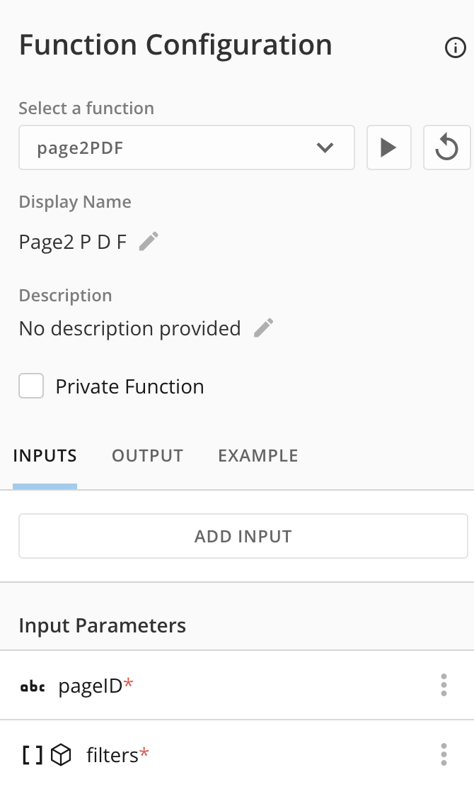

---

### **Step 4: Configure `index.html`**

The `index.html` file serves as the main interface for your app. It includes an input field for Page ID, a button to trigger PDF conversion, and a result message.

```html
<!DOCTYPE html>
<html lang="en">
  <head>
    <meta charset="UTF-8" />
    <meta name="viewport" content="width=device-width, initial-scale=1.0" />
    <link rel="stylesheet" href="app.css" />
    <title>Domo PDF Converter</title>
  </head>
  <body>
    {/* Input field for Page ID */}
    <input
      type="text"
      id="pageIdInput"
      placeholder="Enter Page ID here"
      pattern="[0-9]*"
    />

    {/* Button to trigger the PDF conversion */}
    <button id="convertButton">Convert to PDF</button>

    {/* Result Message */}
    <div id="result" style="display: none;">PDF Generated Successfully!</div>
    <div id="loading-spinner" class="spinner" style="display: none;"></div>
    <div id="error" class="error" style="display: none;"></div>
    <div id="filters"></div>

    {/* Import libraries */}
    <script src="https://unpkg.com/ryuu.js"></script>
    <script src="https://cdnjs.cloudflare.com/ajax/libs/pdf-lib/1.16.0/pdf-lib.min.js"></script>
    <script src="https://cdnjs.cloudflare.com/ajax/libs/html2pdf.js/0.9.3/html2pdf.bundle.min.js"></script>
    <script src="app.js"></script>
  </body>
</html>
```

### **Step 5: Styling with `app.css`**

The `app.css` file defines styles for the app’s layout and elements.

```css
body {
  margin: 0;
  font-family: Arial, sans-serif;
}

#pageIdInput {
  width: 300px;
  padding: 8px;
  margin-right: 10px;
}

#convertButton {
  padding: 8px 15px;
  background-color: #8f2881;
  color: white;
  border-radius: 15px;
  border: none;
  cursor: pointer;
}

.spinner {
  position: fixed;
  top: 50%;
  left: 50%;
  width: 50px;
  height: 50px;
  margin: -25px 0 0 -25px;
  border: 5px solid rgba(0, 0, 0, 0.1);
  border-top: 5px solid #000;
  border-radius: 50%;
  animation: spin 1s linear infinite;
}

@keyframes spin {
  0% {
    transform: rotate(0deg);
  }
  100% {
    transform: rotate(360deg);
  }
}

#error {
  color: red;
  margin-top: 20px;
}
```

### **Step 6: Write JavaScript Logic in `app.js`**

The `app.js` file handles interactions like managing filters, merging PDFs, and triggering the PDF download.

#### 6.1: Initialize Variables and Event Listeners

```javascript
const functionAlias = 'printFunctions';
let filterSet = null;
let filterString = '';

// Listens for filter updates
domo.onFiltersUpdate(handleFilters);

// Add click event to the convert button
document
  .getElementById('convertButton')
  .addEventListener('click', startPDFConversion);

// Hide the Page ID input if a page ID is provided in the environment
if (domo.env.pageId) {
  document.getElementById('pageIdInput').style.display = 'none';
}
```

#### 6.2: Handle Filters

Manage and display the filters applied to the data.

```javascript
function handleFilters(filterEvent) {
  const filterDisplay = document.getElementById('filters');
  filterDisplay.innerHTML = '';
  if (filterEvent && filterEvent.length > 0) {
    filterString = '';
    filterEvent.forEach((filter) => {
      const filterKey = filter.key.replace(/_/g, ' ');
      const filterText = `${filterKey}: ${filter.values.join(', ')}`;
      filterString += filterText + '\n';
      const filterItem = document.createElement('div');
      filterItem.textContent = filterText;
      filterDisplay.appendChild(filterItem);
    });
    filterSet = filterEvent;
  } else {
    filterDisplay.textContent = 'No filters applied, all data shown.';
    filterString = 'No filters applied, all data shown.';
  }
}
```

#### 6.3: Start PDF Conversion

This function triggers the PDF generation and handles user feedback on the result. It uses the Domo Code Engine function to generate the encoded PDF and call the merge function to build the pdf document with all tables and charts in the dashboard.

```javascript
async function startPDFConversion() {
  document.getElementById('loading-spinner').style.display = 'block';
  document.getElementById('result').style.display = 'none';
  const pageId =
    domo.env.pageId ?? document.getElementById('pageIdInput').value;

  if (!pageId) {
    return handleErrors('No Page ID entered');
  }

  try {
    const result = filterSet
      ? await startFunction(functionAlias, {
          pageID: pageId,
          filters: filterSet,
        })
      : await startFunction(functionAlias, { pageID: pageId });

    const pdfArray = result.pdfArray.pdfResult;
    const titleHtml = result.pdfArray.metadata.titleHtml;

    if (pdfArray && pdfArray.length > 0) {
      await mergePDFs(pdfArray, titleHtml);
      document.getElementById('result').style.display = 'block';
    } else {
      handleErrors('No PDF generated for this Page ID.');
    }
  } catch (error) {
    handleErrors(error.message);
  } finally {
    document.getElementById('loading-spinner').style.display = 'none';
  }
}

async function startFunction(functionAlias, inputParameters = {}) {
  return await domo
    .post(`/domo/codeengine/v2/packages/${functionAlias}`, inputParameters)
    .then((data) => data)
    .catch((err) => {
      throw err;
    });
}
```

#### 6.4: Merge PDFs

This function merges individual PDF pages into a single document and downloads it.

PDF-Lib is used for merging multiple PDFs, reordering or resizing pages, and adding customized content like titles or footers. Whereas HTML2PDF is used to generate downloadable PDF files from HTML content

Any time you want to reference the documentaions, please access the [HTML2PDF documentation](https://html2pdf.js.org/) and [PDF-Lib documentation](https://pdf-lib.js.org/).

1.  **Initialize PDF-lib and Create a New Document**:

    - Start by importing the PDF-lib library.
    - Create a new `PDFDocument` object called `mergedPdf` to hold all pages from the PDFs being merged.

2.  **Clean Up the Title String**:

    - Clean up the `titleHtml` string by removing any HTML tags and replacing special characters with newlines to ensure a clear, readable title in the final PDF.

3.  **Iterate Over Each PDF Result**:

    - Create an array named `pdfArray`, with each element (`pdfResult` from the code engine function response) as a base64-encoded PDF string.
    - Loop through each `pdfResult` in the array, decode the base64 string, and load the PDF data into a new `PDFDocument`.
    - Retrieve all pages from the loaded PDF document.

4.  **Conditional Title Addition**:

    - Add a title to the PDF if the `titleHtml` string is not empty.

5.  **Copy Pages to Merged PDF**:

    - For each page in the loaded PDF, copy it to the `mergedPdf` document, accumulating all pages into a single document.

6.  **Create a New Consolidated PDF Document**:

    - After merging pages into `mergedPdf`, create another `PDFDocument` object named `consolidatedPdf`.
    - Add a title page to `consolidatedPdf` that displays the cleaned-up title and any applied filters.

7.  **Organize Pages Based on Size**:

    - Loop over each page in `mergedPdf` and add it to `consolidatedPdf`, positioning based on the page’s width.

8.  **Save and Download the Consolidated PDF**:

    - Save `consolidatedPdf` as a byte array and trigger a download of the final merged PDF using a `download` function.

```javascript
async function mergePDFs(pdfArray, titleHtml) {
  const { PDFDocument, rgb } = PDFLib;
  const mergedPdf = await PDFDocument.create();
  const dashboardTitle = titleHtml
    .replace(/(<([^>]+)>)/gi, '')
    .replaceAll('&#xfeff;', '\n');

  for (const pdfResult of pdfArray) {
    const title = pdfResult.title;
    for (const base64 of pdfResult.image) {
      const pdfData = await fetch(`data:application/pdf;base64,${base64}`).then(
        (res) => res.arrayBuffer(),
      );
      const pdf = await PDFDocument.load(pdfData);
      const pages = await mergedPdf.copyPages(pdf, pdf.getPageIndices());
      mergedPdf.addPage(pages[0]);
    }
  }

  // Add title and filters
  const consolidatedPdf = await PDFDocument.create();
  const titlePage = consolidatedPdf.addPage([1800, 2000]);
  let yPosition = 1900;
  dashboardTitle.split('\n').forEach((line) => {
    titlePage.drawText(line, {
      x: 50,
      y: yPosition,
      size: 50,
      color: rgb(0, 0, 0),
    });
    yPosition -= 75;
  });

  // Add merged pages to the final PDF
  for (const page of mergedPdf.getPages()) {
    const [copiedPage] = await consolidatedPdf.copyPages(mergedPdf, [
      mergedPdf.getPages().indexOf(page),
    ]);
    consolidatedPdf.addPage(copiedPage);
  }

  const mergedPdfBytes = await consolidatedPdf.save();
  download(mergedPdfBytes, 'dashboard.pdf', 'application/pdf');
}

function download(data, fileName, mimeType) {
  const blob = new Blob([data], { type: mimeType });
  const url = URL.createObjectURL(blob);
  const link = document.createElement('a');
  link.href = url;
  link.download = fileName;
  link.click();
  URL.revokeObjectURL(url);
}
```

## **Conclusion**

By following this tutorial, you've built a functional app that converts Domo dashboards into downloadable PDFs, handling filters and merging multiple PDFs into a single file. This app can be further enhanced by adding more customization options and error handling.

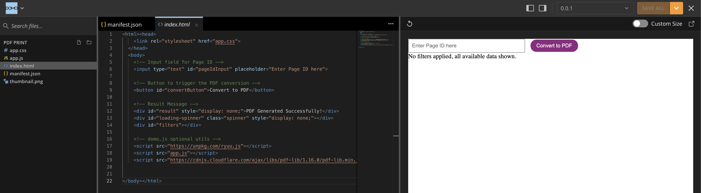
